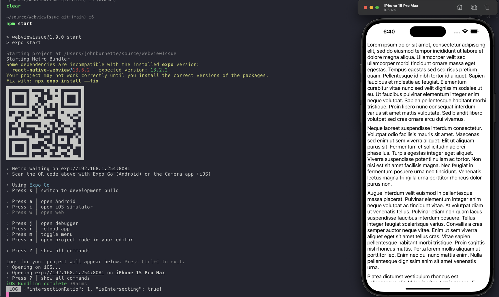
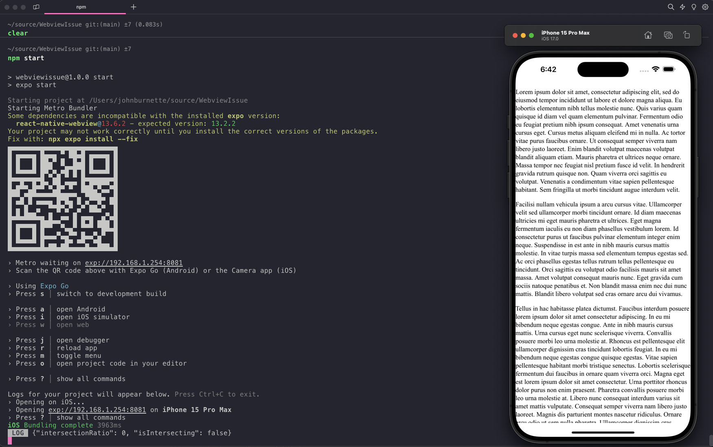

# Webview Issue

This repo is an example of an issue where Intersection Observers report false values when a WebView is a child of a ScrollView component. When the WebView is outside of a ScrollView, it works as intended but when it is a child of a ScrollView, it reports that any element being observed by an Intersection Observer is intersecting with the viewport when it is not physically visible on screen. I should note that using `removeClippedViews` does delay this behavior as you will not see the initial observer entry showing that it is in view, but as soon as you scroll to where the ScrollView will display the WebView you experience the same behavior where elements that are not physically visible report that they are intersecting.

## Running the Repo

To run this example, install the dependencies:

```bash
npm i
```

Then, run the project:

```bash
npm start
```

## Test Scenarios

There are two test cases included in this. One is a WebView that is a child of a ScrollView component and the other is a WebView that is not. The default case when starting this app is the case where the WebView is a child of a ScrollView. To test just a webview, simply comment out the ScrollView, uncomment the WebView in `App.js` and then uncomment the dummy paragraph elements in `assets/observer.html` and reload the app.

### WebView with a ScrollView as the parent element



### WebView without a ScrollView as the parent element


